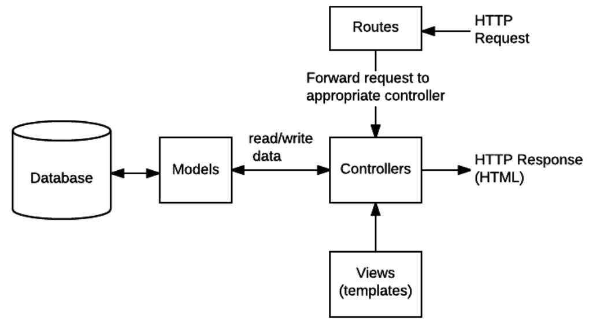

=======================================
------------  Middleware --------------
========================================
 Промежуточное программное обеспечение может выполнять любую операцию, выполнять любой код, вносить изменения в объект запроса и ответа, а также может завершать цикл запрос-ответ. Если он не завершает цикл, он должен вызвать next (), чтобы передать управление следующей функции промежуточного программного обеспечения (или запрос останется зависшим).

  Промежуточное программное обеспечение и функции маршрутизации вызываются в том порядке, в котором они были объявлены. Для некоторого промежуточного программного обеспечения важен порядок (например, если промежуточное программное обеспечение сеанса зависит от промежуточного программного обеспечения cookie, то сначала должен быть добавлен обработчик cookie). Почти всегда случается так, что промежуточное ПО вызывается перед настройкой маршрутов, иначе ваши обработчики маршрутов не будут иметь доступа к функциям, добавленным вашим промежуточным ПО.

  Вы можете добавить функцию промежуточного программного обеспечения в цепочку обработки с помощью app.use () или app.add (), в зависимости от того, хотите ли вы применить промежуточное программное обеспечение ко всем ответам или к ответам с определённым глаголом HTTP (GET, POST и т. д.). Маршруты задаются одинаково в обоих случаях, хотя маршрут необязателен при вызове app.use ().

`
var express = require("express");
var app = express();

// An example middleware function

var a_middleware_function = function (req, res, next) {
  // ... perform some operations
  next(); // Call next() so Express will call the next 
  //middleware function in the chain.
};

// Function added with use() for all routes and verbs
app.use(a_middleware_function);

// Function added with use() for a specific route
app.use("/someroute", a_middleware_function);

// A middleware function added for a specific HTTP verb 
//and route
app.get("/", a_middleware_function);

app.listen(3000);
`

Ошибки обрабатываются одной или несколькими специальными функциями промежуточного программного обеспечения, которые имеют четыре аргумента вместо обычных трёх: (err, req, res, next).

`
app.use(function (err, req, res, next) {
  console.error(err.stack);
  res.status(500).send("Something broke!");
});
`

Они могут возвращать любой требуемый контент, но 
должны вызываться после всех других app.use () и 
маршрутизировать вызовы, чтобы они были последним 
промежуточным ПО в процессе обработки запросов!

Функции в Router - это промежуточный слой (middleware) 
are Express, что означает, что они должны или завершить 
(ответить на) запрос reqили вызвать следующую (next) 
функцию в цепочке. 
В нашем случае запрос завершается вызовом send(), 
поэтому аргумент next не нужен (и поэтому не указан).

Можно указать столько таких аргументов, сколько хотите, 
или указать массив колбэк-функций. 
каждая из функций - это элемент в цепочке промежуточного 
слоя, и они будут вызываться в порядке их добавления в 
цепочку (если предыдущая функция не завершит запрос).

=======================================
------------  "контроллеры" --------------
========================================
"контроллеры" - функции, которые отделяют код
для маршрутизации запросов от кода, который 
фактически обрабатывает запросы.

"Маршруты" для перенаправления поддерживаемых 
запросов (и любой закодированной информации в
URL-запросах) соответствующим функциям 
контроллера.

Контроллеры -функции для получения запрашиваемых 
данных из моделей, создание HTML страницы, 
отображающей данные, и возращение их пользователю 
для просмотра в браузере.

Представления (шаблоны), используемые контроллерами 
для отрисовки данных.

